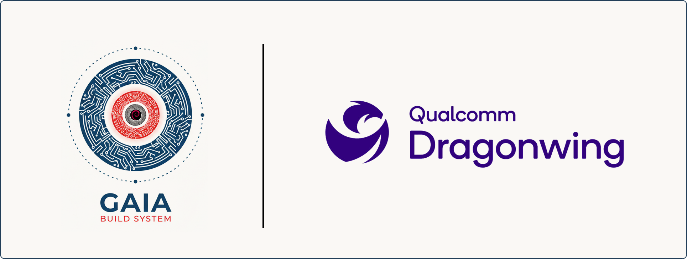

# Cookbook for Qualcomm Dragonwing

<p align="center">
    
</p>

This cookbook provides a collection of recipes to help you get started with DeimOS for Qualcomm Dragonwing.


## Supported Boards -> Machines

| Board                      | Gaia Machine Name   |
|----------------------------|---------------------|
| Arduino Uno Q              | arduino-uno-q       |


## Prerequisites

- [Gaia project Gaia Core](https://github.com/gaiaBuildSystem/gaia);

## Build an Image

```bash
./gaia/bitcook --buildPath /home/user/workdir --distro ./cookbook-qcom/distro-ref-arduino-uno-q.json --noCache
```

This will build DeimOS for Arduino Uno Q.
